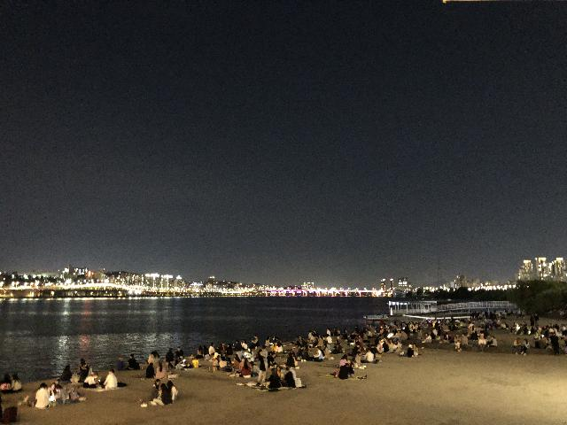
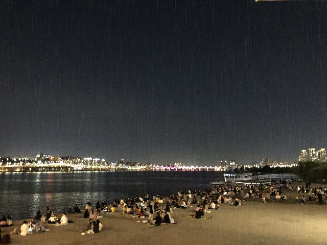
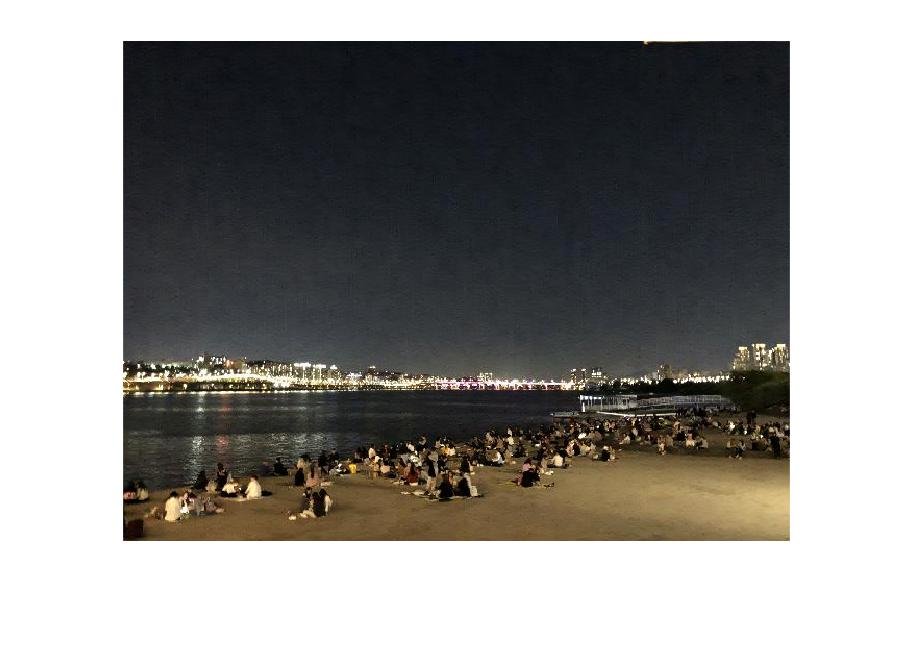

# Removing Rain/Snows from Image & Videos

- code implementations for experiments


## Data Generation
- `generate_rain.py`: `Method gen_rain(img_path)`synthesize rain to original image
- Rain image can be generated by below alogorithm
	```
	# Generate rain layer
	1. Random Noise
	2. Gaussian Blur
	3. Motion Blur (Should be vertical motion blur for natural, Can give little tilting to them)

	# Add rain layer to original image
	4. Easly add to original image
	5. Be care of range of each pixel (I used 8-bit RGB original images, but when synthesizing I changed to double type and restore them.) 
	```

## Metrics
- `metrics.py`: `Method ssim`, `Method psnr`
- I used SSIM and PSNR for Experiments.

## Examples
- Image was taken by myself @ Banpo, 반포한강공원

|Original image| Synthesized image | Derained Image|
|---|:---:|---:|
||||
